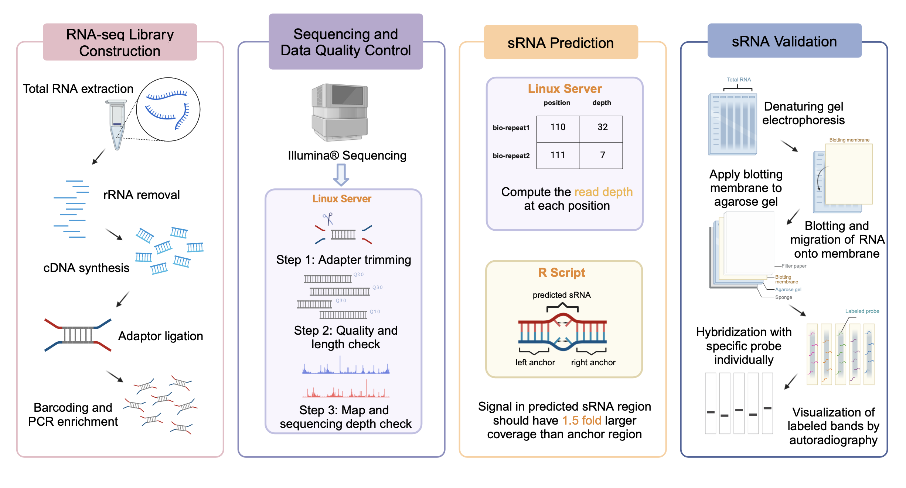

# CCEP-sRNA
Study of pan-sRNome and regulatory mechanisms in pseudomonas aeruginosa reveals virulence-related functions of small non-coding RNAs.

Cheers！

## Graphic abstract

## code
[sRNApredicion.Rmd](code/PAsRNA_DEG.R)
: For sRNA prediction

[Phylo_sRNA.Rmd](code/Phylo_sRNA.Rmd)
: For the phylogenetic study of novel sRNA sequences

[PAsRNA_DEG.R](code/PAsRNA_DEG.R)
: For DEG detection

[Pan_sRNA.Rmd](code/Pan-sRNA.Rmd)
: For Pan-sRNome study in bacteria

[RNAseq.sh](code/RNAseq.sh)
: For raw sequencing file processing with shell script

## Contact Info
Detailed information are available upon resonable request.

Correspondence: xindeng@cityu.edu.hk. 

First Author: Tianminli3-c@my.cityu.edu.hk; beifanglu2-c@my.cityu.edu.hk.
